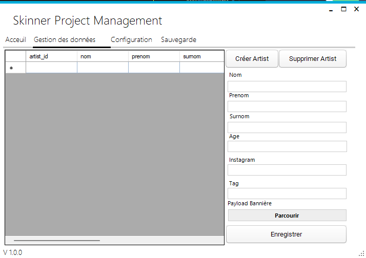

<h1  align="center">
  <br>
  
  <br>
  Tatoo's library management software
  <br>
</h1>


<p align="center">
  <a href="#key-features">Key Features</a> •
  <a href="#how-to-use">How To Use</a> •
  <a href="#download">Download</a> •
  <a href="#credits">Credits</a> •
  <a href="#related">Related</a> •
  <a href="#license">License</a>
</p>

<h1 align="center"></h1>


<!--  -->

## Key Features

- [X] Create, update artists and see result directly in the interface.
  - Instantly see what your 3d model look like on the interface.
- [X] Artists management with their tag to filter them.
- [X] Artist's models management with 3d model (not stacked in db but directly in storage of the interface)
- [x] Interface fully responsive
- [X] Upload GLB and GLTF to preview different tatoo made by many artists on the interface.
- [X] Full interface communicate with mariaDB or mySql database

## How To Use

To clone and run this application, you'll need [Visual studio 2019](https://learn.microsoft.com/en-us/visualstudio/releases/2019/release-notes) and [MySql Installer for visual studio](https://dev.mysql.com/downloads/windows/visualstudio/), you also need docker installed on your computer. From your command line:

```bash
# Clone this repository
$ git clone https://github.com/clementfleur/tatoo-library-software.git
```

> You can after that directly open project in Visual Studio code and build it.
> **Note**
> Don't forget to run the interface which come with a preconfigured locale database created using docker [more](https://github.com/clementfleur/tatoo-library)

## Credits

This software uses the following open source packages:

- [.NET framework > 4.5](https://dotnet.microsoft.com/en-us/download/dotnet-framework)

## Related

[Tatoo Library's management software](https://github.com/clementfleur/tatoo-library) - A Laravel/Vue.js web application which come with fully responsive interface

## You may also like...

- [My School project](https://github.com/clementfleur/Epitech_Project) - From my first year to my third year.

## License

MIT

---

> GitHub [@clementfleur](https://github.com/clementfleur)
> Twitter [@BartzGame](https://twitter.com/BartzGame)
> Discord <a> @Bartz#8618 </a>
